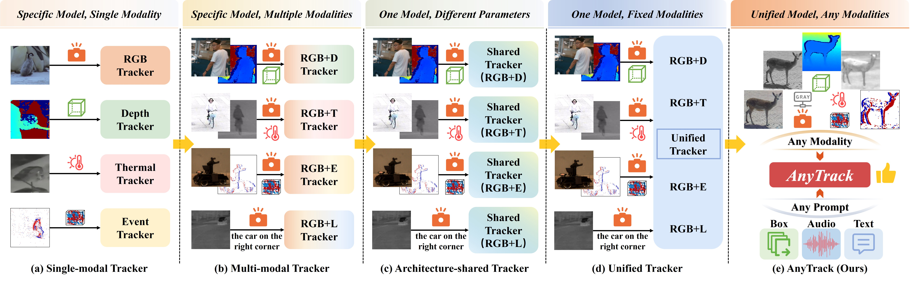
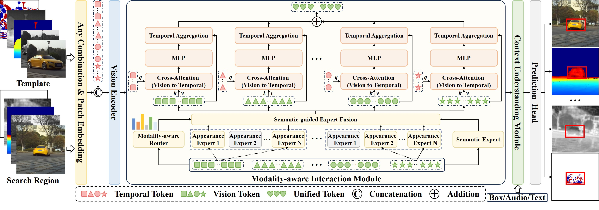
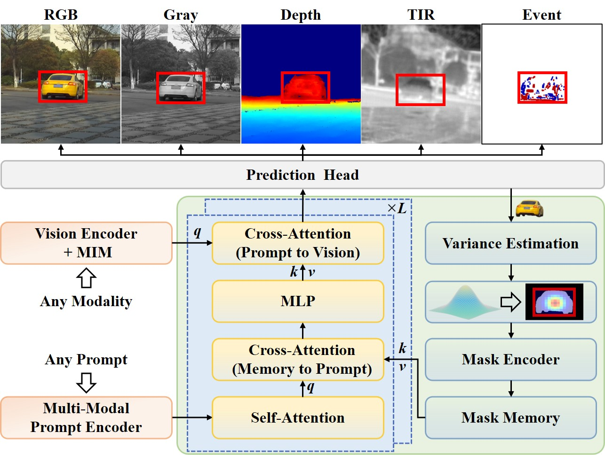
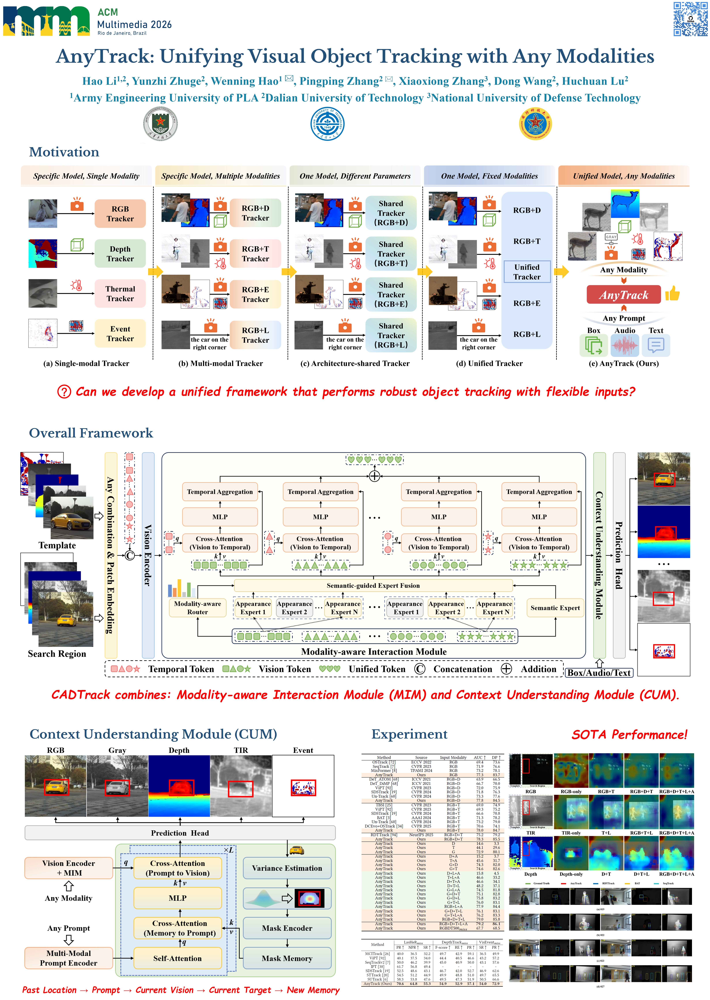

<div align="center">
  
# AnyTrack: Unifying Visual Object Tracking with Any Modalities

[](https://2026.acmmm.org/site/technical-programme.html)
[](https://arxiv.org/abs/2608.06773)
[](https://pan.baidu.com/s/1A2YFV_7KjprnkQMF1IiEJw?pwd=tkwk)
[](https://pan.baidu.com/s/1HmO3Lg8hLBfaHXrf5Hg4zQ?pwd=d5pt)
[](https://pan.baidu.com/s/186HwmOLeufNhqYfiXpkIng?pwd=w3qd)
[](https://github.com/IdolLab/AnyTrack)

### 🔥 One Single Model for Arbitrary Modality Combinations 🔥

*RGB / Grayscale / Depth / Thermal / Event / Language / Audio*

> **AnyTrack: Unifying Visual Object Tracking with Any Modalities**
>
> <a href="https://orcid.org/0009-0009-2668-7908">Hao Li</a>,
> <a href="https://scholar.google.com/citations?user=-37EfvgAAAAJ&hl=zh-CN">Yunzhi Zhuge</a>,
> <a href="https://orcid.org/0000-0002-1526-7889">Wenning Hao</a>📧,
> <a href="https://scholar.google.com/citations?user=MfbIbuEAAAAJ&hl=zh-CN">Pingping Zhang</a>📧,
> <a href="https://orcid.org/0000-0002-3524-7543">Xiaoxiong Zhang</a>,
> <a href="https://scholar.google.com/citations?user=nVgPQpoAAAAJ&hl=zh-CN">Dong Wang</a>,
> <a href="https://scholar.google.com/citations?user=D3nE0agAAAAJ&hl=zh-CN">Huchuan Lu</a>
>
> **ACM Multimedia 2026 • Oral Presentation 🎤**



*Figure 1: Paradigm comparison. From fixed-modality trackers to our any-modality unified framework.*

</div>

---

## 📋 Abstract

<div align="justify">

This repository contains the official implementation of <a href="https://arxiv.org/abs/2608.06773"><strong>AnyTrack</strong></a>, a unified visual object tracking framework that can handle **any combination of modalities** through a single model with flexible prompts. We propose a unified tokenization scheme to convert visual inputs of any modality (RGB, grayscale, depth, thermal infrared, event streams) and auxiliary prompts (box trajectories, text descriptions, audio clips) into a unified token space. A Modality-aware Interaction Module (MIM) based on Mixture-of-Experts dynamically adapts to heterogeneous modalities while maintaining temporal coherence. Furthermore, a Context Understanding Module (CUM) constructs global-local prompts from multi-modal references to enable target-aware context modeling. Extensive experiments on four multi-modal tracking benchmarks (RGBDT500, LasHeR, VisEvent, DepthTrack) demonstrate state-of-the-art performance across various modality combinations.

</div>

---

## ✨ Framework

<p align="center">
  
  <br>
  <em>Figure 2: Overall framework of AnyTrack.</em>
</p>

---

## 🧩 Context Understanding Module (CUM)

<p align="center">
  
  <br>
  <em>Figure 3: Details of CUM.</em>
</p>

---

## 🚀 Quick-Start Guide

### 🔧 Environment Setup

```bash
# clone repo
git clone https://github.com/IdolLab/AnyTrack.git
cd AnyTrack

# create conda environment
conda create -n AnyTrack python=3.10 -y
conda activate AnyTrack

# install python dependencies
pip install -r requirements.txt
```

> **Auxiliary Pre-trained Models Download**
>
> - CLIP: [Baidu Pan](https://pan.baidu.com/s/1szCqV2fQqd9yoHJcIAD8Yg?pwd=hjcf) | pwd: `hjcf`
> - WavLM: [Baidu Pan](https://pan.baidu.com/s/17CaOgI1hLsMd8FJd9_urgg?pwd=mw9k) | pwd: `mw9k`

### 📂 Dataset Preparation

Download the four benchmarks: [RGBDT500](https://xuefeng-zhu5.github.io/RGBDT500/), [LasHeR](https://chenglongli.cn/Datasets-and-benchmark-code/), [DepthTrack](https://github.com/xiaozai/DeT), and [VisEvent](https://github.com/wangxiao5791509/VisEvent_SOT_Benchmark).

We extend RGBDT500 / LasHeR / DepthTrack / VisEvent with **grayscale images, language descriptions, and audio annotations**, and construct the `RGBDT500_miss` modality-missing benchmark.
RGBDT500_miss download: [Baidu Pan](https://pan.baidu.com/s/1ZLmRnpo0Vz2FENjTuBDDgQ?pwd=812g) | pwd: `812g`

```
data/
├── RGBDT500/
│   ├── miss/
│   ├── Test/
│   │   ├── 001/
│   │   │   ├── color/
│   │   │   ├── depth/
│   │   │   ├── gray/
│   │   │   ├── infrared/
│   │   │   ├── audio_description.mp3
│   │   │   └── text.txt
│   │   └── ...                       # other sequences
│   └── Train/
│       └── ...
├── LasHeR/
│   ├── miss/
│   ├── Test/
│   │   ├── 1blackteacher/
│   │   │   ├── visible/
│   │   │   ├── gray/
│   │   │   ├── infrared/
│   │   │   ├── audio_description.mp3
│   │   │   └── text.txt
│   │   └── ...                       # other sequences
│   └── Train/
│       └── ...
├── DepthTrack/
│   ├── miss/
│   ├── Test/
│   │   ├── adapter01_indoor/
│   │   │   ├── color/
│   │   │   ├── gray/
│   │   │   ├── depth/
│   │   │   ├── audio_description.mp3
│   │   │   └── text.txt
│   │   └── ...                       # other sequences
│   └── Train/
│       └── ...
└── VisEvent/
    ├── miss/
    ├── Test/
    │   ├── 00141_tank_outdoor2/
    │   │   ├── vis_imgs/
    │   │   ├── gray_imgs/
    │   │   ├── event_imgs/
    │   │   ├── audio_description.mp3
    │   │   └── text.txt
    │   └── ...                       # other sequences
    └── Train/
        └── ...
```

> Generate the RGBDT500 missing-modality split:

```bash
cd datasets/RGBDT500_miss
python modality_missing_dataset_rgbdt500.py
```

> For LasHeR_miss / DepthTrack_miss / VisEvent_miss, please refer to the original repos:
>
> - LasHeR-miss: [IPL](https://github.com/Alexadlu/Modality%E2%80%91missing%E2%80%91RGBT%E2%80%91Tracking)
> - DepthTrack-miss & VisEvent-miss: [FlexTrack](https://github.com/supertyd/FlexTrack)

### ⚙️ Initialize Local Configuration

```bash
python tracking/create_default_local_file.py --workspace_dir . --data_dir ./datasets --save_dir ./output
```

> Or manually edit the config files:
>
> - `./lib/train/admin/local.py` — training paths
> - `./lib/test/evaluation/local.py` — evaluation paths

### 🎯 Training Pipeline

1. Download the backbone weights: [Baidu Pan](https://pan.baidu.com/s/1Q2EfvFJpDaKYrhBJgRJ0YQ?pwd=62pb) (pwd: `62pb`), and put them into `./pretrained/`
2. Launch the training script:

```bash
bash train.sh
```

> Adjust hyper-parameters & dataset sampling ratios inside `train.sh` for different experiments.

### 🧪 Evaluation & Testing

1. Download our trained AnyTrack checkpoint: [Baidu Pan](https://pan.baidu.com/s/1HmO3Lg8hLBfaHXrf5Hg4zQ?pwd=d5pt) (pwd: `d5pt`), and place it under `./output/`
2. Modify `unified_test.py`: set your `<DATASET_PATH>` and `<SAVE_PATH>`

```bash
bash test.sh
```

> For the DepthTrack benchmark:

```bash
cd Depthtrack_workspace
bash test.sh
```

You can adjust the modality combinations in `test.sh`.

### Evaluation Toolkit

📌 Raw tracking results and per-sequence evaluation files are available at [Baidu Pan](https://pan.baidu.com/s/186HwmOLeufNhqYfiXpkIng?pwd=w3qd) (pwd: `w3qd`).

For [RGBDT500](https://xuefeng-zhu5.github.io/RGBDT500/), [LasHeR](https://chenglongli.cn/Datasets-and-benchmark-code/), [DepthTrack](https://github.com/xiaozai/DeT), and [VisEvent](https://github.com/wangxiao5791509/VisEvent_SOT_Benchmark), please use the corresponding **official evaluation toolkit**.

---

## 🖼️ Poster

<p align="center">
  
</p>

---

## 📎 Citation

If this work benefits your research, please cite our paper:

```bibtex
@article{li2026anytrack,
  title={AnyTrack: Unifying Visual Object Tracking with Any Modalities},
  author={Li, Hao and Zhuge, Yunzhi and Hao, Wenning and Zhang, Pingping and Zhang, Xiaoxiong and Wang, Dong and Lu, Huchuan},
  journal={arXiv preprint arXiv:2608.06773},
  year={2026}
}
```

---

## 🙏 Acknowledgements

Our implementation is built upon these great open-source projects:

- [IPL](https://github.com/Alexadlu/Modality%E2%80%91missing%E2%80%91RGBT%E2%80%91Tracking)
- [FlexTrack](https://github.com/supertyd/FlexTrack)
- [MPT](https://github.com/zj5559/Motion%E2%80%91Prompt%E2%80%91Tracking)

Great thanks to all community contributors!

---

<p align="center">
  <b>⭐ Star this repo if you like our work!</b>
</p>

